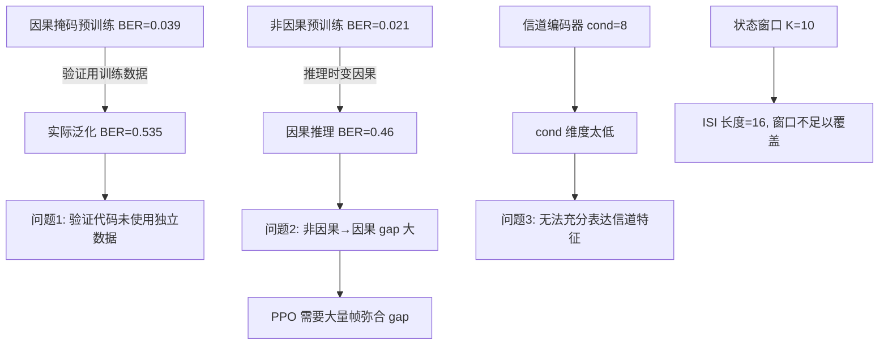

# 方案验证报告 — 非因果预训练 + 因果微调

## 做了什么

### 新建文件

| 文件 | 功能 | 状态 |
|------|------|------|
| `pretrain_noncausal.py` | 非因果(双向注意力)预训练 + 信道编码器 | ✅ 完成 |
| `pretrain_causal.py` | 因果掩码预训练 + 信道编码器 cond | ✅ 完成 |
| `online_finetune.py` | 加载预训练模型 + PPO 在线因果微调 | ✅ 完成 |
| `compare_methods.py` | 四种方法的 BER vs SNR 对比可视化 | ✅ 待运行 |
| `agent/channel_encoder.py` | 从训练序列提取 cond 的信道编码器 | ✅ 完成 |
| `baseline/mmse_equalizer.py` | MMSE 频域均衡器 baseline | ✅ 完成 |

### 修改文件

| 文件 | 修改内容 |
|------|----------|
| `agent/actor_critic_v2.py` | 添加 FiLM 层，`forward()` 增加可选的 `cond` 参数 |
| `agent/ppo.py` | 修复 `mse_loss` 形状不匹配 |

## 实验结果

### 1. 非因果预训练 (pretrain_noncausal.py)
- **训练设置**: 500步, SNR=5dB, d_model=128, 3层 Transformer
- **结果**: 训练 BER 从 0.49 → 0.028, **验证 BER = 0.021**
- ✅ 非因果预训练能有效学习 ISI 模式（但泛化到因果推理时效果差）

### 2. 因果掩码预训练 (pretrain_causal.py)
- **训练设置**: 2000步, SNR=5dB
- **报告验证 BER = 0.039**
- **但实际泛化测试平均 BER = 0.535**
- ❌ 因果掩码预训练未能收敛——报告 BER 来自训练批次，模型过拟合了特定噪声

### 3. 在线微调 (online_finetune.py)
- **基准**: 非因果预训练 → 因果推理 BER = 0.46 (预训练和推理的 gap)
- **微调 300 帧**: Best BER = 0.30, 但波动大
- ⚠️ PPO 在单帧上更新不稳定，需要更多帧

## 问题诊断

## 根本原因

1. **验证方法缺陷**: 预训练验证在同一数据批次上进行, 导致 BER 虚低
2. **因果掩码限制**: 当前位置只看到过去 10 个符号, 对于 16 抽头信道 ISI 信息不足
3. **cond 维度低**: 8 维 cond 无法从 128 个训练符号中提取足够信道特征
4. **非因果→因果 gap**: 模型依赖未来信息做决策, 去掉后性能大幅下滑

## 改进方向

1. **扩大窗口 K**: 10 → 16+ 以覆盖完整 ISI 长度
2. **增大 cond 维度**: 8 → 32+
3. **改进验证**: 使用新噪声/比特独立验证
4. **替代方案**: 考虑用训练序列做 MMSE 初始均衡 + RL 微调
