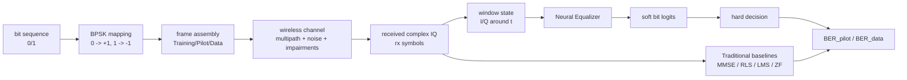
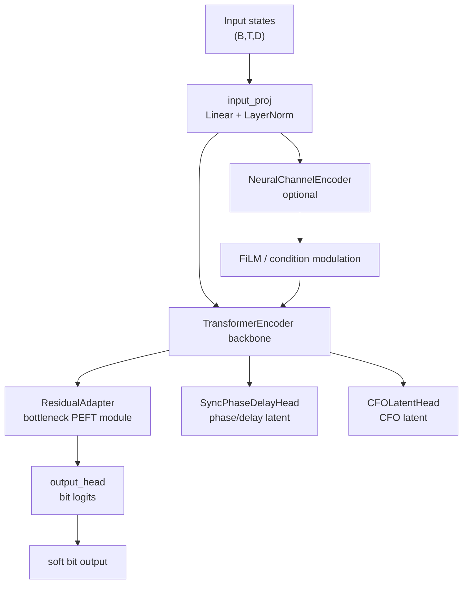
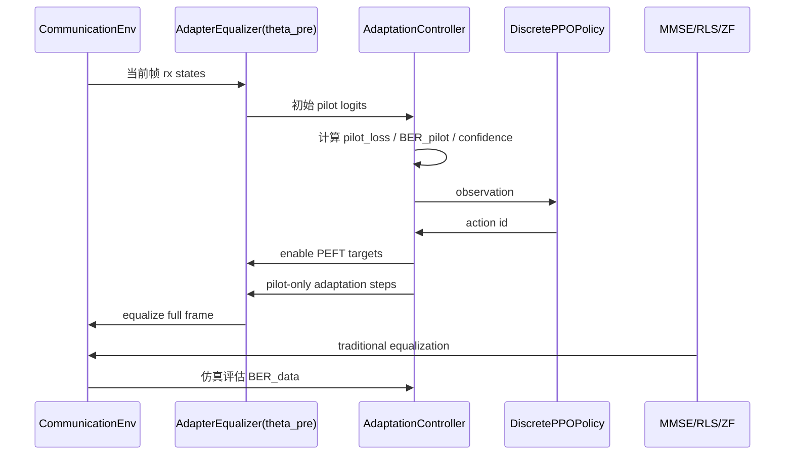
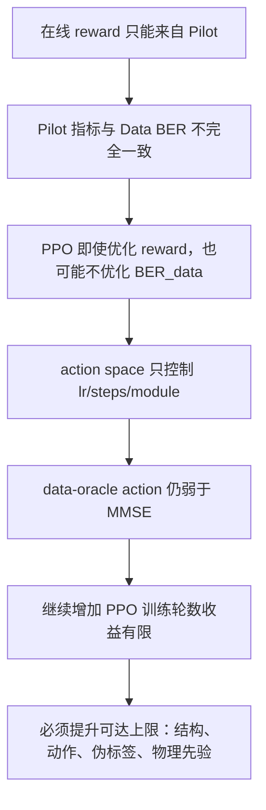
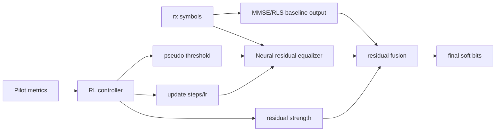

# RL4EQ 强化学习辅助信道均衡系统阶段汇报

生成日期：2026-07-17  
研究主线：**离线大规模监督预训练 + 在线强化学习控制参数高效微调**  
当前定位：硕士第二个研究点，面向无线信道均衡的神经网络与强化学习联合自适应方法  
代码标准：以根目录 `开发框架.md` 为唯一架构标准  
最新图表来源：`logs/ppt_latest_2026-07-17/`

---

## 1. 汇报摘要

### 1.1 当前结论

| 结论项 | 当前判断 | 证据 |
|---|---|---|
| 工程闭环 | 已完成 | 离线预训练、在线 PPO 控制 PEFT、MMSE/RLS/ZF 对比、策略上限诊断均已可运行 |
| 核心主线 | 已明确 | 离线训练 `AdapterEqualizer` 得到 `theta_pre`，在线只根据 Pilot 选择少量参数更新 |
| 当前性能 | 未稳定超过 MMSE/RLS | Rayleigh 10 dB 下 PEFT `BER_data=0.05008`，MMSE `BER_data=0.01820` |
| 主要瓶颈 | 不是单纯 PPO 训练不足 | data-oracle action 仍弱于 MMSE，说明 action space 与可调参数上限不足 |
| 论文表述 | 不宜写成“全面优于 MMSE” | 更合理表述为“RL 控制参数高效自适应，并分析其相对传统均衡的适用边界” |

### 1.2 最新重跑结果概览

| 实验 | 配置 | PEFT/RL | 传统基线 | 结论 |
|---|---:|---:|---:|---|
| 在线主流程 | Rayleigh, SNR=10 dB, 50 frames | `BER_data=0.05008` | MMSE `0.01820` | 在线 PEFT 闭环成立，但主指标弱于 MMSE |
| SNR 扫描 | 0/5/10/15/20 dB, 30 frames/point | 10 dB: `0.04010` | 10 dB MMSE: `0.01576` | PEFT 随 SNR 改善，但整体曲线偏高 |
| Rayleigh 策略诊断 | 24 frames | data-oracle `0.03353` | MMSE `0.01530` | 策略选择不是唯一瓶颈 |
| Rician 策略诊断 | 24 frames | data-oracle `0.01530` | MMSE `0.00798` | Rician 同样存在 action 上限不足 |
| 传统多信道 baseline | 50 frames/channel | - | Rayleigh MMSE `0.01039`, RLS `0.01242` | 传统线性/自适应滤波先验很强 |
| 失配场景 | CFO/Doppler/Nonlinear/Low Pilot | Doppler PEFT `0.05801` | RLS `0.01328` | 失配鲁棒性仍不足 |

---

## 2. 当前系统总架构

### 2.1 总体研究路线


### 2.2 两阶段分工

| 阶段 | 输入 | 标签可用性 | 主要模型 | 输出 | 约束 |
|---|---|---|---|---|---|
| Offline Stage | 大规模随机信道帧 | Training/Pilot/Data 全部可用 | `AdapterEqualizer` | `theta_pre` checkpoint | 可用 Data 标签训练 |
| Online Stage | 当前帧 Pilot + Data | 仅 Training/Pilot 可在线监督 | `DiscretePPOPolicy` + `AdaptationController` | 少量参数更新后的均衡结果 | reward 不允许使用 `BER_data` |
| Evaluation | 仿真真实 bits | 全部可见 | PEFT vs MMSE/RLS/ZF | `BER_data` 等指标 | `BER_data` 仅评估，不进 reward |

### 2.3 当前主入口与模块边界

| 文件 | 职责 |
|---|---|
| `pretrain.py` | 离线监督预训练入口，输出可被在线阶段加载的 `AdapterEqualizer` checkpoint |
| `online_train.py` | 在线 PEFT + PPO 主入口，包含策略诊断、伪标签、action probing、失配场景 |
| `compare.py` | SNR 扫描、多信道 baseline、失配场景、低 pilot 和 RLS 审计入口 |
| `agent/neural_equalizer.py` | 神经均衡器主体：`AdapterEqualizer`、`ResidualAdapter`、`ChannelEncoder`、`Sync/CFO Head` |
| `agent/adaptation_controller.py` | 在线参数更新控制器与 action table |
| `agent/adaptation_policy.py` | 离散 PPO 策略 |
| `env/frame_structure.py` | 帧结构、known mask、pilot/data 划分 |
| `env/comm_env.py` | 通信环境、信道调用、IQ 状态构造、CFO/非线性扰动 |
| `env/rayleigh_channel.py` | Rayleigh 多径信道 |
| `env/rician_channel.py` | Rician 多径信道 |
| `env/_3gpp_channel.py` | EPA/EVA/ETU 标准信道 |
| `baseline/mmse_equalizer.py` | MMSE 及传统均衡 baseline |
| `tests/test_parameter_efficient_adaptation.py` | 参数高效自适应主线测试 |

---

## 3. 信号系统架构

### 3.1 端到端信号流程



### 3.2 信号类型

| 信号 | 代码中的形式 | 用途 | 在线阶段是否可用 |
|---|---|---|---|
| `bits` | `0/1` float tensor | 原始标签、BER 评估 | Training/Pilot 可用，Data 在线不可用 |
| `tx_symbols` | BPSK symbols | 信道输入 | 仿真内部可见 |
| `rx_symbols` | complex IQ | 均衡器输入 | 可用 |
| `states` | `(T, state_dim)` | 神经均衡器输入 | 可用 |
| `known_mask` | bool mask | Training/Pilot 监督位置 | 可用 |
| `data_mask` | bool mask | Data 评估位置 | 在线不可监督 |
| `logits` | real-valued soft output | bit 判决与 BCE loss | 可用 |

### 3.3 帧结构

当前标准帧长为 `512`，由 `FrameConfig` 定义。

```text
| Training 128 | Pilot 64 | Data 128 | Pilot 64 | Data 128 |
|<----------- known ---------->|<- unknown ->|<- known ->|<- unknown ->|
```

| 区段 | 长度 | 标签用途 | 在线作用 |
|---|---:|---|---|
| Training | 128 | 已知 | 传统均衡器估计、在线监督 |
| Pilot 1 | 64 | 已知 | pilot loss、pilot BER、RL reward |
| Data 1 | 128 | 仿真可知 | 只用于 `BER_data` 评估 |
| Pilot 2 | 64 | 已知 | pilot loss、pilot BER、RL reward |
| Data 2 | 128 | 仿真可知 | 只用于 `BER_data` 评估 |

### 3.4 输入状态结构

当前神经均衡器以滑动窗口方式构造每个符号位置的状态：

```text
state(t) = rx_window_IQ(t-K:t+K) + position / mask features
K = 10 by default
```

| 状态分量 | 含义 | 作用 |
|---|---|---|
| `rx_window_IQ` | 当前符号附近复数接收窗口的 I/Q 展开 | 捕获多径 ISI 局部上下文 |
| `known_symbol` | 已知位置的参考 bit/symbol 信息 | 让模型区分可监督位置 |
| `known_mask` | Training/Pilot 位置标识 | 在线 loss 只在已知位置计算 |
| `data_mask` | Data 位置标识 | 评估 data BER |
| MMSE features | 可选传统均衡辅助特征 | 增强线性先验与 residual 学习 |

---

## 4. 信道类型与扰动覆盖

### 4.1 当前信道族

| 信道/扰动 | 实现位置 | 主要参数 | 目的 | 当前表现 |
|---|---|---|---|---|
| Rayleigh 多径 | `env/rayleigh_channel.py` | `num_taps`, `delay_spread`, `snr_db`, `doppler_hz` | 无直达径随机多径 | 当前最主要瓶颈之一 |
| Rician 多径 | `env/rician_channel.py` | `k_factor_db`, `num_taps`, `doppler_hz` | 含 LoS 分量的多径 | 仍弱于 MMSE |
| EPA | `env/_3gpp_channel.py` | 7 抽头 profile | 步行环境 | 神经模型通常较容易 |
| EVA | `env/_3gpp_channel.py` | 9 抽头 profile | 车载环境 | 多轮迭代中曾优于 MMSE |
| ETU | `env/_3gpp_channel.py` | 9 抽头 profile | 城市环境 | 多轮迭代中曾优于 MMSE |
| CFO | `env/comm_env.py`, `online_train.py` | `cfo_norm` | 载波频偏失配 | 目前接近随机，需显式监督 |
| Doppler | `mismatch_scenarios()` | `time_varying`, `doppler_hz` | 时变信道 | RLS/MMSE 仍强 |
| Nonlinear | `env/comm_env.py` | `nonlinear_alpha` | 非线性幅相扰动 | PEFT 未超过传统强基线 |
| Low Pilot | `frame_config_for_known_ratio()` | known ratio | 低导频开销 | RLS 明显强 |

### 4.2 最新传统基线多信道对比


| Channel | Matched Filter | ZF | LMS | RLS | MMSE | 最优传统方法 |
|---|---:|---:|---:|---:|---:|---|
| Rayleigh | 0.06336 | 0.05344 | 0.02031 | 0.01242 | 0.01039 | MMSE |
| Rician | 0.04883 | 0.02922 | 0.01047 | 0.00945 | 0.00797 | MMSE |
| EPA | 0.00117 | 0.00469 | 0.00000 | 0.00000 | 0.00375 | LMS/RLS |
| EVA | 0.02695 | 0.01344 | 0.00117 | 0.00016 | 0.00453 | RLS |
| ETU | 0.04023 | 0.01938 | 0.00164 | 0.00109 | 0.00617 | RLS |

**分析。**  
Rayleigh/Rician 上 MMSE 仍非常强，说明传统方法的线性信道反演先验在当前仿真条件下高度有效。EPA/EVA/ETU 上 RLS/LMS 也表现很强，说明仅与 MMSE 对比不足，后续论文必须保留 RLS、公平性和复杂度讨论。

---

## 5. 离线阶段：大规模监督预训练

### 5.1 离线训练目标

离线阶段的目标不是直接训练 RL，而是学习一个跨信道的均衡初始化 `theta_pre`。


### 5.2 当前神经网络架构



| 组件 | 当前作用 | 选型理由 |
|---|---|---|
| `input_proj` | 将窗口状态投影到 `d_model` | 统一不同输入特征维度，便于 checkpoint 同构 |
| Transformer backbone | 建模符号序列上下文 | 相比单点 MLP 更适合处理 ISI 与跨位置依赖 |
| `ResidualAdapter` | 低秩瓶颈残差模块 | 在线只更新少量参数，降低过拟合和延迟 |
| `output_head` | 输出 bit logits | 在线可快速微调判决边界 |
| `NeuralChannelEncoder` | 从状态中提取信道上下文 | 给模型提供帧级条件信息 |
| `SyncPhaseDelayHead` | 学习同步/相位/时延 latent | 针对 Rayleigh/Rician 的相位与对齐不稳定 |
| `CFOLatentHead` | CFO latent correction | 为 CFO 失配场景预留显式补偿路径 |
| residual/MMSE assisted head | 利用传统先验做残差修正 | 当前最有希望提升 action 上限的方向 |

### 5.3 离线迭代记录中的关键事实

| 时间 | 迭代内容 | 结果 | 结论 |
|---|---|---|---|
| 2026-07-11 | 增加 Rician、可变 Rayleigh、Channel Encoder | 纯神经 mean `BER_data=0.03499`，MMSE `0.00840` | Rayleigh/Rician 是主瓶颈 |
| 2026-07-12 | 增加 `SyncPhaseDelayHead`，提高 Rayleigh/Rician 占比 | 最终独立评估 mean `0.01109`，MMSE `0.00840` | 3GPP 已有价值，Rayleigh/Rician 仍弱 |
| 2026-07-15 00 | 增加 CFO head、selective distillation、RLS 公平性审计 | selective distill 离线 `best_data_ber=0.002734` | 离线能力提升，但在线仍未超过 MMSE/RLS |
| 2026-07-15 19 | 方向 A 策略诊断 + 方向 C 伪导频门控 | data-oracle `0.04590`，MMSE `0.01432` | action space 上限不足 |
| 2026-07-15 23 | action probing、disagreement gate、checkpoint 诊断 | data-oracle `0.04346`，MMSE `0.02051` | reward 和 action 上限均不足 |
| 2026-07-15 23:40 | probe-rule selector、probe-aware imitation、扩展 action space、checkpoint 自动对齐 | data-oracle `0.03467`，MMSE `0.01904` | selector 已不是唯一瓶颈 |

---

## 6. 在线阶段：强化学习控制参数高效微调

### 6.1 在线处理流程



### 6.2 Observation / Action / Reward

| 项 | 当前实现 | 说明 |
|---|---|---|
| Observation | pilot loss、pilot BER、置信度、SNR、EMA 历史、last reward、可选 action probing 摘要 | 只使用在线可见信息 |
| Action | 离散 action table，共包含 skip/head/adapter/both/pseudo/residual/sync/CFO 等策略 | 控制哪些参数可训练、学习率、步数、正则和伪标签 |
| Reward | pilot loss 改善 - 参数漂移惩罚 - 步数/延迟代价 | 不使用 `BER_data` |
| Evaluation | `BER_data`, `BER_pilot`, `pilot_loss`, `adapt_params`, `adapt_steps`, `latency_ms`, `generalization` | `BER_data` 仅仿真评估 |

### 6.3 当前 action space

| Action 类别 | 代表 action | 可训练目标 | 设计目的 |
|---|---|---|---|
| 跳过更新 | `skip` | none | 判断预训练模型本身表现 |
| 输出头更新 | `head-slow`, `head-fast` | output head | 快速调整判决边界 |
| Adapter 更新 | `adapter-slow`, `adapter-fast` | adapter/sync | 低成本适应信道变化 |
| 联合更新 | `both-slow`, `both-fast`, `both-deep` | adapter + output + sync | 提高单帧适应强度 |
| Residual 更新 | `residual-light` | residual head | 尝试 MMSE residual correction |
| Sync 更新 | `sync-only` | sync/CFO related head | 针对相位/时延失配 |
| 伪导频 | `pseudo-both-fast`, `pseudo-both-deep`, `pseudo-disagree-light` | adapter + output + sync + pseudo data | 用高置信 data 伪标签扩展监督 |
| CFO 控制 | `cfo-light`, `cfo-strong` | sync/output/adapter + correction strength | CFO 场景补偿 |

### 6.4 参数高效微调的必要性

| 方案 | 优点 | 风险 | 当前取舍 |
|---|---|---|---|
| 全模型在线更新 | 表达能力最高 | 单帧过拟合、延迟高、破坏预训练先验 | 不采用 |
| 只更新 output head | 最快 | 只能改判决边界，不能修正深层表征 | 作为 action 子集 |
| Adapter/LoRA 更新 | 参数少，表达力适中 | action 空间和 reward 设计决定上限 | 当前主线 |
| residual-over-MMSE | 利用传统先验，学习非线性/失配残差 | 需要重新定义模型输入和论文主张 | 后续优先方向 |

---

## 7. 最新实验图表与诊断

### 7.1 在线主流程结果


| Method | BER_data | BER_pilot | pilot_loss | adapt_params | adapt_steps | latency_ms |
|---|---:|---:|---:|---:|---:|---:|
| PEFT/PPO | 0.05008 | 0.03234 | 0.10338 | 40911.18 | 1.50 | 58.61 |
| MMSE | 0.01820 | 0.01453 | 0.00000 | 0.00 | 0.00 | 0.00 |

**结论。**  
当前在线 PEFT 过程能够稳定执行，并且每帧仅更新约 4 万个参数；但是在 Rayleigh 10 dB 上，主指标仍明显弱于 MMSE。

### 7.2 SNR 曲线


| SNR | PEFT BER_data | MMSE BER_data | 差距 |
|---:|---:|---:|---:|
| 0 dB | 0.11484 | 0.08490 | +0.02995 |
| 5 dB | 0.06419 | 0.03346 | +0.03073 |
| 10 dB | 0.04010 | 0.01576 | +0.02435 |
| 15 dB | 0.03633 | 0.01432 | +0.02201 |
| 20 dB | 0.02461 | 0.01966 | +0.00495 |

**结论。**  
PEFT 随 SNR 提升而改善，但多数 SNR 点仍弱于 MMSE。20 dB 差距缩小，说明神经均衡器在高信噪比下的错误部分可能更接近可修正区域。

### 7.3 策略空间上限诊断


| Method | BER_data | BER_pilot | pilot_loss | adapt_params | latency_ms |
|---|---:|---:|---:|---:|---:|
| skip | 0.04378 | 0.03092 | 0.09875 | 0.00 | 0.00 |
| PPO policy | 0.04069 | 0.02637 | 0.08560 | 40333.88 | 53.27 |
| probe_rule_selector | 0.03434 | 0.02051 | 0.06514 | 50349.00 | 114.47 |
| pilot_oracle_action | 0.03434 | 0.02051 | 0.06514 | 50349.00 | 114.47 |
| data_oracle_action | 0.03353 | 0.02344 | 0.07604 | 39781.00 | 72.43 |
| MMSE | 0.01530 | 0.00944 | 0.00000 | 0.00 | 0.00 |

**核心判断。**  
`data_oracle_action` 是在仿真中使用真实 data BER 选择最优 action 的上限。如果该上限仍弱于 MMSE，则继续训练 PPO 不能解决根本问题。当前结果说明瓶颈主要在 **action space 的可达性能** 和 **可调参数机制**，而不是策略选择器本身。

### 7.4 Pilot-Data 相关性


| Profile | `delta_pilot_loss` vs `delta_BER_data` | `BER_pilot` vs `BER_data` | 解释 |
|---|---:|---:|---|
| Rayleigh | 0.56637 | 0.70309 | 有中等相关性，但不足以保证选到 data 最优 action |
| Rician | -0.07147 | 0.80849 | pilot loss 改善与 data BER 改善可能相反 |

**核心判断。**  
Pilot 指标并非无效，但不稳定。尤其 Rician 下 `delta_pilot_loss` 与 `delta_BER_data` 相关性为负，说明 reward 代理目标存在结构性错配。

### 7.5 失配场景


| Scenario | PEFT | MMSE | RLS | 结论 |
|---|---:|---:|---:|---|
| CFO | 0.48418 | 0.49883 | 0.50215 | 整体接近随机，需显式 CFO 监督 |
| Doppler | 0.05801 | 0.02539 | 0.01328 | RLS 时变自适应先验强 |
| Nonlinear | 0.08320 | 0.04238 | 0.04121 | PEFT 未形成非线性优势 |
| Low Pilot | 0.13125 | 0.05221 | 0.03177 | 低 pilot 下 RLS 仍明显更强 |

**核心判断。**  
当前失配场景没有形成神经/RL 相对传统方法的稳定优势。CFO 场景下，PEFT 和传统方法都接近随机，说明需要显式同步估计，而不是仅依赖 bit-level loss 间接学习 CFO。

---

## 8. 为什么当前结果与 MMSE 接近，甚至弱于传统均衡

### 8.1 原因总表

| 问题 | 表现 | 根本原因 | 证据 |
|---|---|---|---|
| 传统先验强 | Rayleigh/Rician 上 MMSE/RLS 很低 | 当前信道近似线性多径，传统 FIR/线性估计天然匹配 | Rayleigh MMSE `0.01039`，RLS `0.01242` |
| action space 上限不足 | data-oracle 仍弱于 MMSE | RL 只能在有限 PEFT 策略中选，无法产生更强均衡结构 | Rayleigh data-oracle `0.03353`，MMSE `0.01530` |
| reward 代理错配 | pilot loss 改善不稳定对应 data BER 改善 | Pilot 分布不能完全代表 Data 段误差 | Rician 相关性 `-0.07147` |
| 在线监督稀疏 | 只用 Training/Pilot 更新 | Data 段真实标签不可用，伪标签质量不稳定 | pseudo ratio 低，disagreement 样本少 |
| CFO 学习信号弱 | CFO 场景接近随机 | 仅靠 BCE 难以学到显式频偏值和相位旋转 | CFO PEFT `0.48418` |
| Rayleigh/Rician 随机性强 | 3GPP 较好，随机信道较弱 | 随机多径相位、抽头变化、残余对齐难 | 多轮迭代均指出 Rayleigh/Rician 为主瓶颈 |

### 8.2 当前瓶颈逻辑链



### 8.3 论文风险

| 可能表述 | 风险 | 建议表述 |
|---|---|---|
| RL 均衡全面优于 MMSE | 当前证据不支持 | RL 控制参数高效微调在部分场景有潜力，但受 action 上限和 reward 代理限制 |
| PPO 训练不足导致性能差 | 诊断不充分 | 当前 data-oracle 上限也弱于 MMSE，说明结构上限不足 |
| RLS 可忽略 | 不严谨 | RLS 公平性审计已通过，应作为强 baseline 保留 |
| 伪标签能直接解决在线监督不足 | 当前不成立 | 伪标签需要可靠门控、时序一致性和 residual 目标配合 |

---

## 9. 当前选型理由

### 9.1 为什么使用 Transformer + Adapter

| 需求 | 选型 | 理由 |
|---|---|---|
| 多径 ISI 上下文 | Transformer | 能建模符号间依赖，不局限于固定 FIR 形式 |
| 在线低成本更新 | Adapter | 参数量小，可冻结主干，降低单帧过拟合 |
| 跨信道条件变化 | Channel Encoder / FiLM | 为模型提供帧级信道上下文 |
| 相位/同步误差 | Sync/CFO Head | 针对 Rayleigh/Rician 和 CFO 的主要困难 |
| 传统先验融合 | residual/MMSE assisted | 有利于缩小与 MMSE/RLS 的结构差距 |

### 9.2 为什么使用离散 PPO

| 选型 | 优点 | 当前局限 |
|---|---|---|
| 离散 PPO | 实现稳定，适合 action table，便于诊断 | 动作粒度粗，只能选预定义更新策略 |
| action probing | 能估计每个 action 的 pilot-only 后果 | 增加 latency，且 pilot 最优不等于 data 最优 |
| probe-rule selector | 可作为强规则 baseline | 仍受 action space 上限限制 |
| imitation from oracle | 可学习仿真 data-oracle | 当前 observation 和样本规模不足 |

### 9.3 为什么保留传统 baseline

| Baseline | 必要性 |
|---|---|
| MMSE | 线性信道强先验基准，是当前主要对照 |
| RLS | 在线自适应 FIR 强基线，低 pilot 和时变场景表现强 |
| LMS | 较弱但有在线学习属性，可作为复杂度参照 |
| ZF | 反演型传统方法，可暴露噪声增强问题 |
| Matched Filter | 最简单参考，衡量信道难度下界 |

---

## 10. 后续可行方案

### 10.1 在现有 `开发框架.md` 主线内推进

优先级从高到低：

| 优先级 | 方案 | 目标 | 验收标准 |
|---:|---|---|---|
| 1 | 提升 data-oracle upper bound | 先证明 action space 有能力接近/超过 MMSE | data-oracle `BER_data <= MMSE BER_data` 或差距显著缩小 |
| 2 | residual-over-MMSE action | 让 RL 控制 residual correction 强度，而不是只控制训练模块 | Rayleigh/Rician 上优于单纯 PEFT action |
| 3 | 显式 CFO 回归监督 | 让 `CFOLatentHead` 学到真实 `cfo_norm` | CFO 场景 BER 远低于随机 |
| 4 | 时序 reward | 用跨帧一致性、置信度稳定性替代单帧 pilot loss | pilot-data 相关性提高 |
| 5 | 伪标签质量提升 | 从 agreement gate 扩展到可靠 disagreement correction | pseudo action 明显优于 both-deep |
| 6 | 连续动作控制 | 从离散 lr/steps 扩展到连续 correction strength / pseudo weight | PPO/SAC/DDPG action 能超过规则 selector |
| 7 | 多场景 curriculum | 离线按 Rayleigh/Rician/CFO/Doppler 分阶段训练 | 泛化评估方差下降 |

### 10.2 建议的新主结构：Model-Assisted RL Residual Equalizer

当前系统若保持完全神经均衡器与 MMSE 平行对比，Rayleigh/Rician 上很难稳定超过传统方法。更建议将研究主张调整为：

> 以传统均衡器提供物理先验，神经网络学习 residual correction，RL 控制在线 residual 更新强度与伪标签使用策略。



| 模块 | 作用 | 预期收益 |
|---|---|---|
| MMSE/RLS reference | 提供强线性先验 | 不再让神经模型从零学习信道反演 |
| Neural residual | 只学习传统方法错误区域 | 降低学习难度 |
| RL controller | 控制 residual 强度、伪标签阈值、更新预算 | 将 RL 的作用限制在高价值决策 |
| Disagreement mining | 挖掘 neural 与 MMSE 分歧样本 | 找到可能超过传统方法的空间 |
| Explicit sync/CFO head | 对物理失配建模 | 解决 CFO 接近随机的问题 |

### 10.3 后续实验矩阵

| 实验 | 横轴 | 纵轴 | 关键图 |
|---|---|---|---|
| Oracle upper bound | action space 版本 | BER_data | data-oracle vs MMSE |
| Reward 相关性 | reward 设计 | pilot-data correlation | scatter plot |
| Residual ablation | residual strength action | Rayleigh/Rician BER | bar plot |
| CFO supervision | CFO label/no label | CFO scenario BER | mismatch plot |
| Low pilot | known ratio | PEFT/MMSE/RLS BER | pilot overhead plot |
| Complexity | adapt_params / latency | BER_data | Pareto curve |

---

## 11. 建议汇报口径

### 11.1 一句话主线

> 本研究构建了一个两阶段信道均衡框架：离线阶段利用大规模随机无线信道进行监督预训练，得到具备跨信道初始化能力的神经均衡器；在线阶段仅利用当前帧 Pilot 可观测信息，由强化学习策略选择少量参数的高效微调方式，以在不使用 Data 标签的约束下完成自适应均衡。

### 11.2 当前阶段贡献

| 贡献 | 说明 |
|---|---|
| 完整系统闭环 | 从随机信道生成、监督预训练、在线 PEFT、PPO 策略到传统基线对比均已实现 |
| 可诊断实验体系 | 支持 fixed strategy、PPO、probe rule、pilot oracle、data oracle、MMSE/RLS 对比 |
| 参数高效在线更新 | 在线只更新 adapter/output/sync/residual 等少量参数 |
| 失配场景分析 | 覆盖 CFO、Doppler、非线性、低 Pilot |
| 瓶颈定位明确 | 当前关键不是单纯 PPO 训练不足，而是 action space 与 reward 代理目标上限不足 |

### 11.3 当前阶段不足

| 不足 | 影响 |
|---|---|
| Rayleigh/Rician 上弱于 MMSE | 不能支撑全面超越传统均衡的论文主张 |
| data-oracle 上限不足 | 继续训练 PPO 无法根本解决 |
| pilot reward 不稳定 | 在线目标与 data BER 存在错配 |
| CFO 缺少显式监督 | CFO 场景接近随机 |
| RLS 强 baseline 必须保留 | 论文实验需要更严格复杂度和公平性对比 |

### 11.4 汇报结论

当前系统已经完成从离线预训练到在线强化学习控制微调的工程闭环，并具备多信道、多基线、多策略诊断能力。最新实验表明，当前框架的主要限制不在于 PPO 是否继续训练，而在于在线可观测 Pilot 信号、reward 代理目标、离散 action space 和传统均衡强先验之间存在结构性差距。后续应优先提升 action space 的 data-oracle 上限，并将研究重点转向 **MMSE/RLS assisted residual PEFT equalizer**、显式 CFO/sync 建模和可靠伪标签控制。

---

## 12. 附：最新图表路径

| 图表 | 路径 |
|---|---|
| 在线自适应指标 | `logs/ppt_latest_2026-07-17/online_rayleigh/online_adapt_metrics.png` |
| SNR 对比 | `logs/ppt_latest_2026-07-17/snr_compare/snr_mmse_comparison.png` |
| 多信道 baseline | `logs/ppt_latest_2026-07-17/channel_baselines/channel_baseline_comparison.png` |
| Rayleigh 策略矩阵 | `logs/ppt_latest_2026-07-17/strategy_rayleigh/strategy_matrix.png` |
| Pilot-Data 相关性 | `logs/ppt_latest_2026-07-17/strategy_rayleigh/pilot_data_correlation.png` |
| 失配场景对比 | `logs/ppt_latest_2026-07-17/mismatch/mismatch_scenario_comparison.png` |

